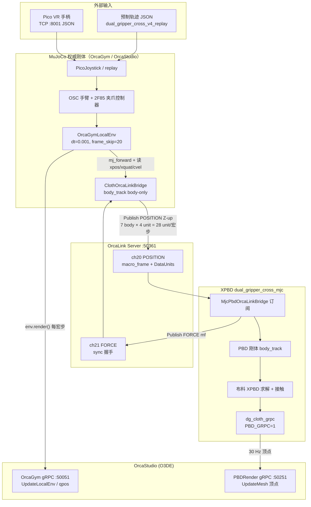

# Cloth Robot 数据传输链路

> 路径：`OrcaManipulation/src/examples/dataCollection_cloth/Cloth_Robot_DATA_FLOW.md`  
> 适用入口：`data_collection_cloth_tele.py --cloth-coupling`  
> 配置：`cloth_sim_config.orcagym_e2e.json`（继承 `dual_gripper_cross_full.json`）  
> 更新：2026-06-12

本文描述**外部输入 → MuJoCo 刚体 → OrcaLink → XPBD 刚体/布料 → OrcaStudio 显示**的典型端到端数据流。物理耦合与画面显示是**多条独立通道**，不可混用。

---

## 1. 总览



---

## 2. 进程与启动顺序

| 顺序 | 进程 | 角色 |
|------|------|------|
| 1 | **OrcaStudio Play** | 场景显示；PBDRender Gem（`cloth_demo`）监听 **:50251** |
| 2 | **OrcaLink Server** `:50361` | 宏步帧中继；session **102**，须 **2 客户端** 就绪（`cloth_mujoco` + `xpbd_pbd`） |
| 3 | **XPBD** `dual_gripper_cross_mjc` | 订阅 ch20，解算刚体+布；`PBD_GRPC=1` 推顶点到 Studio |
| 4 | **data_collection_cloth_tele** | OrcaGym 主控 + Pico/replay + OrcaLink 发布端 |

`cloth_sim_config.orcagym_e2e.json` 将 OrcaLink / XPBD 设为 `auto_start: true`，可由 Python 主进程自动拉起。亦可手动启动后使用 `dual_gripper_cross_full.json`（`auto_start: false`）。

---

## 3. 单宏步时序（50 Hz，Δt = 0.02 s）

主循环在 `DataCollectionManager.run_episode()` 中：**每迭代 = 1 个宏步**。

```
① run_controllers()          ← 读 Pico/replay，算手臂 OSC + 夹爪 ctrl
② ClothCouplingHandle.step()  （envs/cloth/attach_coupling.py）
     ├─ mj_forward()          ← 由 ctrl/qpos 更新 body 位姿
     ├─ 采集 7 刚体 body 状态（Z-up）
     ├─ OrcaLink Publish ch20 POSITION(macro_frame)
     └─ sync 模式：阻塞等 ch21 FORCE(macro_frame)  ← 与 XPBD 宏步对齐
③ env.step()                  ← mj_step × 20（子步 dt=0.001）
④ env.render()                ← gRPC → Studio 刚体显示
```

XPBD 侧（同一宏步边界）：

```
Subscribe ch20 POSITION(mf)
  → Z-up → Y-up 坐标变换（MjcPbdOrcaLinkBridge）
  → body_track 驱动 7 个 PBD 刚体（掌运动学 + 指 compliance）
  → phys_world_step × 32（子步 dt ≈ 0.000625）
  → 布料-刚体接触求解
  → dg_cloth_grpc_submit（30 Hz 节流）→ Studio UpdateMesh
  → Publish ch21 FORCE(mf)     ← sync 回执
```

参考实现：

- MuJoCo 发布：`OrcaPlayground/examples/embodied/cloth/modules/cloth_orcalink_bridge.py`
- 挂载到 OrcaGym：`OrcaManipulation/src/envs/cloth/attach_coupling.py`
- XPBD gRPC：`XPBD/src/demos/dual_gripper_cross_mjc/dg_cloth_grpc.c`

---

## 4. 各段载荷说明

### 4.1 外部输入 → MuJoCo

| 阶段 | 数据 | 格式 / 频率 |
|------|------|-------------|
| VR 遥操 | Pico 手柄位姿 + 按键 | TCP JSON @ ~50 Hz（`PicoJoystick` TCP Server `:8001`） |
| 轨迹回放 | 预制 JSON | `PicoJoystick(replay_mode=True)`，格式与 VR 一致 |
| 控制器输出 | `ctrl`（关节 / 夹爪） | 每宏步 1 次 |
| MuJoCo 状态 | `qpos`, `xpos`, `xquat`, `cvel` | **Z-up**；四元数 Hamilton **`(w,x,y,z)`**（同 `xquat`） |

回放数据链：

```
dual_gripper_cross_trajectory_v4.py（关键帧）
    → generate_pico_replay_data.py
    → dual_gripper_cross_v4_replay.json
    → data_collection_cloth_tele.py --replay
```

规格详见：`XPBD/RobotHand_Trajoctory.md`。

### 4.2 MuJoCo → OrcaLink（ch20 POSITION）

| 项 | 值 |
|----|-----|
| 客户端名 | `cloth_mujoco` |
| 通道 | **ch20**，publish |
| Session | **102**，`control_mode: sync`，`expected_clients: 2` |
| 每宏步 payload | **body_track body-only**：每刚体 4 个 DataUnit：`body_p` + `body_q` + `body_v` + `body_ω` |
| 刚体数 | 7（`base` + 双爪掌/指，见 `rigid_body_map`） |
| 每宏步 unit 总数 | **28** |
| 坐标 | **Z-up**（MuJoCo 原生，不经 Studio 变换） |
| 帧号 | `macro_frame` 单调递增；与 ch21 FORCE 一一对应 |

刚体映射：`cloth_sim_config.dual_gripper_cross_full.json` → `rigid_body_map`。  
OrcaGym / Studio 场景通过 `adapt_config_for_orcagym()`（`envs/cloth/body_map_orcagym.py`）过滤 MJCF 中不存在的 body；无 anchor SITE 时仍可按 body-only 发包。

### 4.3 OrcaLink → XPBD（刚体下行）

| 项 | 值 |
|----|-----|
| 客户端名 | `xpbd_pbd` |
| 通道 | **ch20** subscribe |
| 消费端 | `MjcPbdOrcaLinkBridge`（`XPBD/Orca/OrcaLinkBridge`） |
| 坐标变换 | OrcaLink **Z-up** → XPBD 内部 **Y-up** |
| 物理语义 | PBD 刚体跟随 MJC 位姿；布料在 XPBD 内与 PBD 刚体碰撞、摩擦 |

v1 为**单向位姿耦合**：力/力矩**不回传** MuJoCo；ch21 FORCE 仅用于 **sync 宏步握手**，不驱动物理。

### 4.4 XPBD → OrcaStudio（布料显示）

| 项 | 值 |
|----|-----|
| 协议 | gRPC `UpdateMesh`（GrpcClient patch + `SoftBodyTrans`） |
| 地址 | `localhost:50251`（`particle_render.grpc_address`） |
| 频率 | **30 Hz**（`dg_cloth_grpc` 内 `PARTICLE_INTERVAL` 节流） |
| 数据 | 布料变形顶点（`shirt_v4.vtk`，约 828 顶点） |
| 启用 | 环境变量 **`PBD_GRPC=1`**（`particle_render.enabled` 时由 `start_cloth_coupling` 注入） |

**布料专用显示通道**，与 OrcaLink、MuJoCo 刚体 gRPC 无关。

### 4.5 MuJoCo → OrcaStudio（刚体显示）

| 项 | 值 |
|----|-----|
| 协议 | OrcaGym gRPC **`localhost:50051`** |
| 调用 | 每宏步 `env.render()` → UpdateLocalEnv |
| 数据 | MuJoCo `qpos`（机械臂、夹爪等刚体网格） |
| 原则 | 刚体画面以 **MJC 驱动源** 为准，不用 XPBD 滞后位姿 |

---

## 5. 三条通道对照（易混点）

| 通道 | 传什么 | 谁发 → 谁收 | 用途 |
|------|--------|-------------|------|
| **A. 刚体物理** | body 位姿 / 速度 | MJC → OrcaLink ch20 → XPBD | XPBD 刚体跟踪 + 布-刚接触 |
| **B. 布料显示** | 布料顶点 mesh | XPBD → Studio **:50251** | PBDRender 形变渲染 |
| **C. 刚体显示** | 关节 / 刚体 qpos | MJC → Studio **:50051** | 场景中机械臂 / 夹爪网格 |

- **A 与 C** 同源（MuJoCo），协议与消费方不同。  
- **B** 独立来自 XPBD，仅负责布料形变画面。

更完整的架构背景见：`XPBD/MjcPBD_orcalink/MjcPBD_scheme.md` §3.3。

---

## 6. 频率分层

```
宏步边界（macro_dt）     50 Hz  (0.02 s)
├─ MuJoCo               20 子步/宏步  (dt = 0.001 s, frame_skip = 20)
├─ OrcaLink             1× POSITION + 1× FORCE / 宏步（sync）
├─ XPBD                 32 子步/宏步  (substep_dt ≈ 0.000625 s)
└─ Studio 显示
     ├─ 刚体             ~50 Hz（随 env.render）
     └─ 布料             ~30 Hz（PBD_GRPC 节流）
```

配置对齐项（`cloth_sim_config.dual_gripper_cross_full.json`）：

```json
"frame_count": {
  "mujoco_substeps_per_macro_frame": 20,
  "xpbd_substeps_per_macro_frame": 32,
  "macro_dt_sec": 0.02
}
```

CLI `--frame-skip` 应与 `mujoco.frame_skip` 一致，否则宏步与 XPBD 错位。

---

## 7. 典型运行

### 7.1 前置条件

1. **OrcaStudio Play**：推荐关卡 **`test20260508`**（openloong + PBDRender）；须含 **MujocoEnv**（`:50051`）。若缺失，运行 `OrcaStudio_2409/Levels/test20260508/configure_test20260508_mujoco_env.py` 后 **重新打开关卡** 再 Play。布料 gRPC 为 PBDRender Gem **:50261**（非 ParticleRender 的 50251）。  
2. **XPBD 已编译**：`cd XPBD && ./build.sh dual_gripper_cross_mjc`。  
3. **Python 路径**：`OrcaLink/Client/Python` + `OrcaManipulation/src`。  
4. **宏步对齐**：`--frame-skip 20` 与配置一致。

### 7.2 一键回放（自动起 OrcaLink + XPBD）

```bash
# 终端 1：OrcaStudio Play

# 终端 2：
cd OrcaManipulation/src/examples/dataCollection_cloth
./run_cloth_e2e_replay.sh
```

### 7.3 手动命令

```bash
export PYTHONPATH=/path/to/OrcaApr24/OrcaLink/Client/Python:/path/to/OrcaManipulation/src

# 若无回放 JSON，先生成：
python generate_pico_replay_data.py

python data_collection_cloth_tele.py \
  --level <Studio关卡名> \
  --agent_name openloong \
  --replay \
  --replay_data ./dual_gripper_cross_v4_replay.json \
  --max-episode-sec 67 \
  --frame-skip 20 \
  --time-step 0.001 \
  --cloth-coupling \
  --cloth-config /path/to/OrcaPlayground/examples/embodied/cloth/cloth_sim_config.orcagym_e2e.json
```

日志目录：`dataCollection_cloth/logs/`（OrcaLink、XPBD 子进程 stdout）。

---

## 8. 相关文件索引

| 文件 | 说明 |
|------|------|
| `data_collection_cloth_tele.py` | 主入口；`--cloth-coupling` 挂载布料耦合 |
| `generate_pico_replay_data.py` | 轨迹 → Pico JSON |
| `run_cloth_e2e_replay.sh` | 端到端回放冒烟脚本 |
| `envs/cloth/attach_coupling.py` | `start_cloth_coupling` / `ClothCouplingHandle` |
| `cloth_sim_config.orcagym_e2e.json` | 自动起 OrcaLink+XPBD 的 e2e 配置 |
| `cloth_sim_config.dual_gripper_cross_full.json` | 完整 MjcPBD 参数与 `rigid_body_map` |
| `XPBD/RobotHand_Trajoctory.md` | Pico replay 方案 A 规格 |
| `XPBD/MjcPBD_orcalink/MjcPBD_scheme.md` | MjcPBD 系统设计 |
| `XPBD/README_cloth.md` | 三仓联调说明 |
| `terminology.md` | 术语表（`envs.cloth`、`PBD_GRPC` 等） |

---

## 9. 故障排查速查

| 现象 | 可能原因 |
|------|----------|
| OrcaLink 长期 1/2 session | XPBD 或 MuJoCo 发布端未 JoinSession；检查启动顺序与 `expected_clients` |
| sync 超时 / publish 失败 | XPBD 未回 ch21 FORCE；或 `macro_frame` 与两侧子步不对齐 |
| Studio 无布料 | PBDRender 未 Play；或 `PBD_GRPC` 未设 / `:50251` 不可达 |
| 发布刚体数为 0 | Studio MJCF 无 `rigid_body_map` 中的 body 名；换关卡或改映射 |
| 刚体与布视觉错位 | 正常轻微滞后；调 XPBD `body_track` 增益或减小 sync 窗口 |
